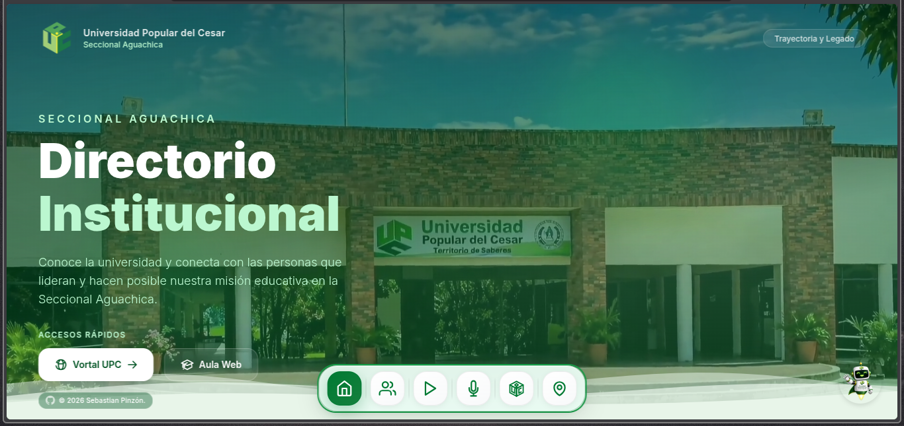
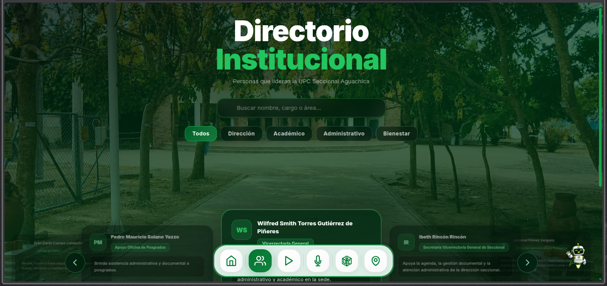
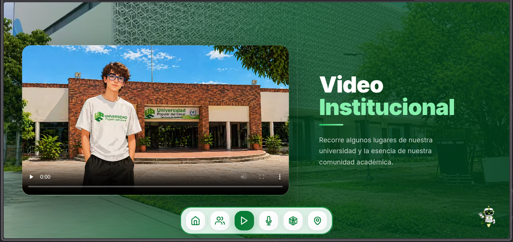
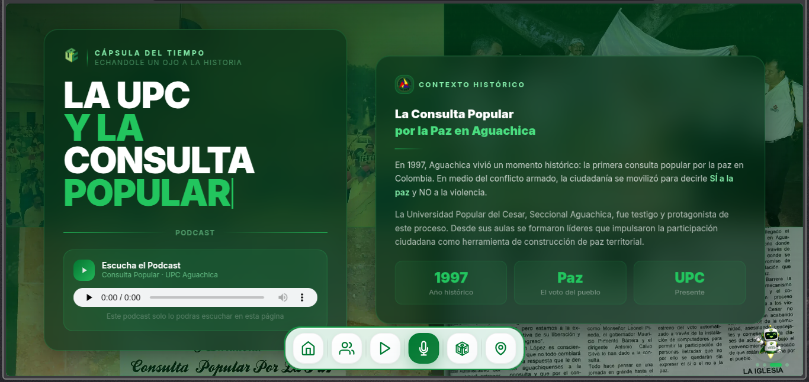
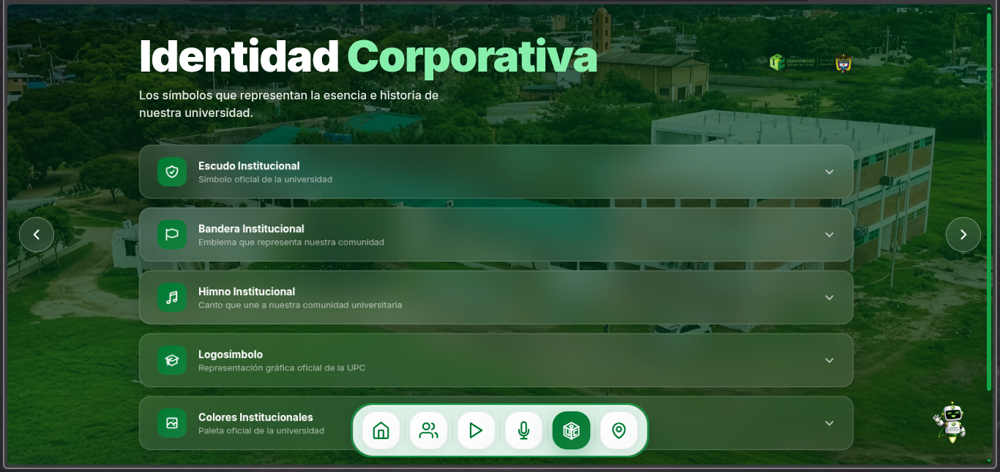
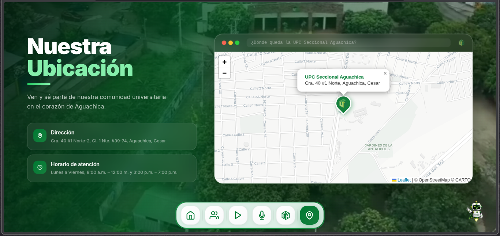

# DIRECTORIO UPC

**Directorio institucional de la Universidad Popular del Cesar — Seccional Aguachica.**

Consulta el equipo directivo, conoce la identidad corporativa, escucha el podcast histórico y encuentra la ubicación de la universidad.

---

## Vista previa

<table>
  <tr>
    <td align="center"><b>Sección Inicio</b></td>
    <td align="center"><b>Sección Directorio</b></td>
  </tr>
  <tr>
    <td></td>
    <td></td>
  </tr>
  <tr>
    <td align="center"><b>Sección Video</b></td>
    <td align="center"><b>Sección Podcast</b></td>
  </tr>
  <tr>
    <td></td>
    <td></td>
  </tr>
    <tr>
    <td align="center"><b>Sección Identidad</b></td>
    <td align="center"><b>Sección Ubicación</b></td>
  </tr>
  <tr>
    <td></td>
    <td></td>
  </tr>
</table>

---

## Tecnologías

### Frontend


### Framework


---

## Características

- **Directorio institucional** — Consulta el equipo directivo filtrado por área (Dirección, Académico, Administrativo, Bienestar)
- **Búsqueda en tiempo real** — Filtra personas por nombre o cargo directamente desde el cliente
- **Video institucional** — Recorre los espacios y la comunidad académica de la universidad 
- **Podcast histórico** — Episodio sobre la Consulta Popular por la Paz en Aguachica (1997) 
- **Identidad corporativa** — Escudo, bandera, logosímbolo, paleta de colores y himno institucional con reproductor de audio
- **Navegación horizontal** — Dock fijo con 6 botones que desplazan suavemente entre secciones
- **Accesos rápidos** — Links directos al Vortal UPC, al Aula Web institucional y a la pagina principal de la seccional Aguachica
- **Sección de ubicación** — Dirección, horario de atención y referencia geográfica
- **Diseño responsive** — Adaptado para móvil, tablet y escritorio

---

## ¿Qué contiene la página?

```
1. Inicio      → Hero con video de fondo, presentación institucional y accesos rápidos
2. Directorio  → Grid del equipo directivo con filtros por categoría y búsqueda
3. Video       → Reproductor del video institucional de la universidad
4. Podcast     → Audio sobre la Consulta Popular 1997 + contexto histórico y galería
5. Identidad   → Escudo, bandera, himno (con audio), logosímbolo y paleta corporativa
6. Ubicación   → Dirección, horario y referencia de cómo llegar a la seccional
```

La navegación entre secciones es completamente horizontal mediante un dock flotante con scroll suave.

---